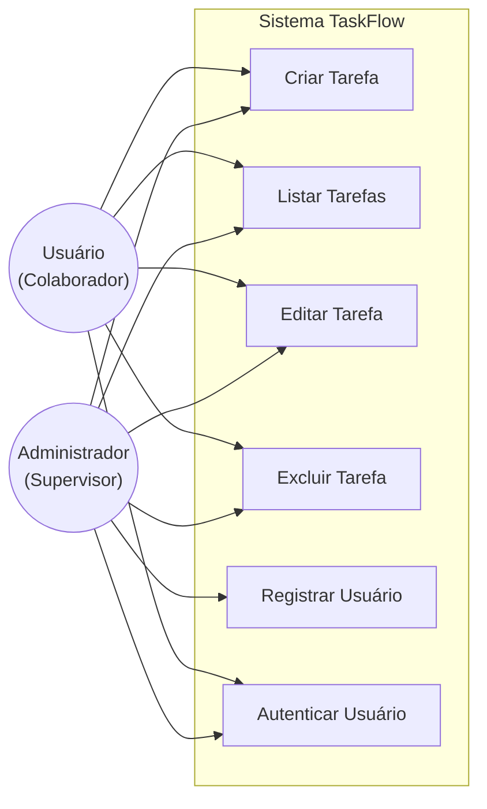
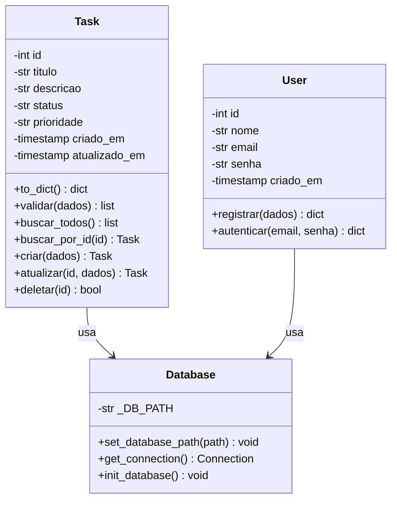

# Parte Teórica — TaskFlow: Sistema de Gerenciamento de Tarefas
**Disciplina:** Engenharia de Software  
**Empresa fictícia:** TechFlow Solutions  
**Cliente:** LogiTrack (Startup de Logística)  
**Data:** Maio de 2026

---

## 1. Descrição do Projeto e Escopo Inicial

### 1.1 Contexto

A **TechFlow Solutions** foi contratada pela **LogiTrack**, uma startup de logística em rápido crescimento, para desenvolver um sistema digital de gerenciamento de tarefas. Antes da solução, a equipe da LogiTrack controlava suas atividades por planilhas e mensagens de WhatsApp, o que causava perda de tarefas, duplicidade de esforço e dificuldade em identificar gargalos no fluxo de trabalho.

### 1.2 Escopo Inicial Definido

O escopo inicial foi acordado com o cliente após uma reunião de levantamento de requisitos e contemplava:

| # | Funcionalidade | Prioridade |
|---|----------------|-----------|
| 1 | CRUD completo de tarefas (criar, listar, editar, excluir) | Alta |
| 2 | Campo de prioridade: baixa, média, alta | Alta |
| 3 | Campo de status: pendente, em progresso, concluída | Alta |
| 4 | API RESTful com respostas em JSON | Alta |
| 5 | Testes automatizados com Pytest | Média |
| 6 | Pipeline CI/CD com GitHub Actions | Média |

### 1.3 Delimitações do Escopo Inicial

Ficou explicitamente **fora** do escopo inicial: autenticação de usuários, notificações por e-mail, relatórios gráficos e aplicativo mobile. Esses itens foram registrados como backlog para versões futuras.

---

## 2. Metodologia Ágil Utilizada

### 2.1 Kanban — Escolha e Justificativa

Optamos pelo **Kanban** como metodologia ágil principal pelas seguintes razões:

1. **Equipe pequena**: Um desenvolvedor e um gestor de projeto não justificam o overhead administrativo do Scrum (cerimônias, papéis formais, sprints rígidas).
2. **Escopo evolutivo**: O cliente ainda não tinha todos os requisitos definidos ao início do projeto, o que tornava sprints com comprometimentos fixos arriscadas.
3. **Entrega contínua**: O Kanban favorece o fluxo contínuo de valor — cada funcionalidade é entregue assim que concluída, sem esperar o fim de uma sprint.

### 2.2 Estrutura do Quadro Kanban

```
┌─────────────────┬──────────────────────┬──────────────────┐
│    A FAZER      │    EM PROGRESSO      │    CONCLUÍDO     │
│   (To Do)       │   (In Progress)      │     (Done)       │
├─────────────────┼──────────────────────┼──────────────────┤
│                 │                      │                  │
│  Card 11:       │  Card 5:             │  Card 1:         │
│  Autenticação   │  GitHub Actions CI   │  Estrutura base  │
│  de usuários    │                      │  do projeto      │
│  (mudança de    │                      │                  │
│  escopo)        │                      │  Card 2:         │
│                 │                      │  Banco de dados  │
│                 │                      │                  │
│                 │                      │  Card 3:         │
│                 │                      │  CRUD Tarefas    │
│                 │                      │                  │
│                 │                      │  Card 4:         │
│                 │                      │  Testes unitários│
└─────────────────┴──────────────────────┴──────────────────┘
```

### 2.3 Cards do Kanban (10 cards mínimos)

| # | Card | Coluna |
|---|------|--------|
| 1 | Criar estrutura base do projeto (diretórios, README) | Done |
| 2 | Configurar banco de dados SQLite | Done |
| 3 | Implementar CRUD de tarefas (routes/tasks.py) | Done |
| 4 | Criar modelo Task com validações | Done |
| 5 | Testes unitários do modelo (test_models.py) | Done |
| 6 | Testes de integração da API (test_tasks.py) | Done |
| 7 | Configurar pipeline GitHub Actions | Done |
| 8 | Documentar endpoints no README | Done |
| 9 | Adicionar cobertura de código (pytest-cov) | Done |
| 10 | Refinar validações de entrada da API | Done |
| 11 | **[Mudança de escopo]** Implementar autenticação de usuários | To Do |

### 2.4 Princípios Ágeis Aplicados

- **Entrega incremental**: Cada funcionalidade foi desenvolvida e testada de forma independente, permitindo entrega parcial ao cliente.
- **Colaboração com o cliente**: A mudança de escopo (autenticação) foi incorporada sem interromper o trabalho existente.
- **Resposta à mudança**: O card de autenticação entrou no quadro imediatamente após a solicitação, com priorização adequada.
- **Qualidade contínua**: O pipeline CI executa testes e linting a cada commit, evitando que código quebrado chegue à branch principal.

---

## 3. Importância da Modelagem na Engenharia de Software

A modelagem é a atividade de criar representações abstratas de um sistema antes ou durante sua construção. Ela é fundamental por diversas razões:

### 3.1 Comunicação entre Stakeholders

Diagramas UML criam uma linguagem comum entre desenvolvedores, gerentes e clientes — independentemente do nível técnico de cada um. Um diagrama de Casos de Uso permite que o cliente valide se o sistema fará exatamente o que ele precisa, sem precisar ler código.

### 3.2 Detecção Precoce de Problemas

Modelar antes de codificar revela inconsistências, ambiguidades e dependências ocultas que seriam muito mais caras de corrigir em produção. É muito mais barato apagar uma seta num diagrama do que refatorar uma classe em produção.

### 3.3 Documentação Viva

Os diagramas servem como referência para novos membros da equipe e para manutenção futura. No TaskFlow, o Diagrama de Classes documentou claramente a responsabilidade de cada classe antes de escrever a primeira linha de código.

### 3.4 Base para Estimativas

A modelagem permite decompor o sistema em partes menores, facilitando estimativas de esforço mais precisas — essencial em projetos ágeis onde o backlog é priorizado por valor de negócio.

---

## 4. Diagramas UML

### 4.1 Diagrama de Casos de Uso

O diagrama abaixo representa as interações entre os atores do sistema e suas funcionalidades:

```
┌─────────────────────────────────────────────────────────────────┐
│                    Sistema TaskFlow                             │
│                                                                 │
│   ┌──────────────────┐      ┌──────────────────────────────┐   │
│   │  <<use case>>    │      │  <<use case>>                │   │
│   │  Criar Tarefa    │      │  Registrar Usuário           │   │
│   └──────────────────┘      └──────────────────────────────┘   │
│                                                                 │
│   ┌──────────────────┐      ┌──────────────────────────────┐   │
│   │  <<use case>>    │      │  <<use case>>                │   │
│   │  Listar Tarefas  │      │  Autenticar Usuário          │   │
│   └──────────────────┘      └──────────────────────────────┘   │
│                                                                 │
│   ┌──────────────────┐                                         │
│   │  <<use case>>    │                                         │
│   │  Editar Tarefa   │                                         │
│   └──────────────────┘                                         │
│                                                                 │
│   ┌──────────────────┐                                         │
│   │  <<use case>>    │                                         │
│   │  Excluir Tarefa  │                                         │
│   └──────────────────┘                                         │
└─────────────────────────────────────────────────────────────────┘
        ▲                                    ▲
        │                                    │
   ┌────┴─────┐                        ┌─────┴──────┐
   │  Usuário │                        │   Admin    │
   │ (Colabo- │                        │(Supervisor)│
   │  rador)  │                        └────────────┘
   └──────────┘
```

**Versão Mermaid (para GitHub):**



**Descrição dos casos de uso:**

| Caso de Uso | Ator | Descrição |
|-------------|------|-----------|
| Criar Tarefa | Usuário, Admin | Registra nova tarefa com título, descrição e prioridade |
| Listar Tarefas | Usuário, Admin | Exibe todas as tarefas ordenadas por data |
| Editar Tarefa | Usuário, Admin | Atualiza campos e/ou status de uma tarefa existente |
| Excluir Tarefa | Usuário, Admin | Remove permanentemente uma tarefa do sistema |
| Registrar Usuário | Admin | Cria credenciais de acesso para novo colaborador |
| Autenticar Usuário | Usuário, Admin | Verifica identidade por e-mail e senha |

---

### 4.2 Diagrama de Classes

O diagrama abaixo mostra a estrutura de classes do sistema, seus atributos, métodos e relacionamentos:

```
┌──────────────────────────────────────┐
│              Task                    │
├──────────────────────────────────────┤
│ - id: int                            │
│ - titulo: str                        │
│ - descricao: str                     │
│ - status: str                        │
│ - prioridade: str                    │
│ - criado_em: timestamp               │
│ - atualizado_em: timestamp           │
├──────────────────────────────────────┤
│ + to_dict(): dict                    │
│ + validar(dados): list               │
│ + buscar_todos(): list[Task]         │
│ + buscar_por_id(id): Task            │
│ + criar(dados): Task                 │
│ + atualizar(id, dados): Task         │
│ + deletar(id): bool                  │
└──────────────────────────────────────┘
          │ usa
          ▼
┌──────────────────────────────────────┐
│            Database                  │
├──────────────────────────────────────┤
│ - _DB_PATH: str                      │
├──────────────────────────────────────┤
│ + set_database_path(path): void      │
│ + get_connection(): Connection       │
│ + init_database(): void              │
└──────────────────────────────────────┘
          ▲ usa
          │
┌──────────────────────────────────────┐
│              User                    │
├──────────────────────────────────────┤
│ - id: int                            │
│ - nome: str                          │
│ - email: str (único)                 │
│ - senha: str                         │
│ - criado_em: timestamp               │
├──────────────────────────────────────┤
│ + registrar(dados): dict             │
│ + autenticar(email, senha): dict     │
└──────────────────────────────────────┘
```

**Versão Mermaid (para GitHub):**



---

## 5. Mudança de Escopo — Justificativa

### 5.1 O que mudou

Durante o desenvolvimento, o cliente **LogiTrack** solicitou a inclusão de **autenticação de usuários** no sistema. Essa funcionalidade não estava prevista no escopo original.

### 5.2 Por que aconteceu

Após duas semanas de uso do protótipo da API, supervisores da LogiTrack perceberam que qualquer pessoa com acesso à rede interna conseguia modificar ou excluir tarefas de outros setores. Em um ambiente logístico — onde uma tarefa mal alterada pode gerar atrasos em rotas de entrega — esse risco era inaceitável.

### 5.3 Como foi gerenciada

1. **Registrar**: Um novo card foi adicionado ao quadro Kanban com a descrição "Implementar autenticação de usuários", inicialmente na coluna "A Fazer".
2. **Priorizar**: O card recebeu prioridade alta e foi alocado para a Sprint 2, sem comprometer as entregas da Sprint 1.
3. **Implementar**: Foi criado o módulo `src/routes/auth.py` com endpoints de `/registro` e `/login`, e a tabela `users` foi adicionada ao banco de dados.
4. **Documentar**: O README.md foi atualizado com a seção "Mudança de Escopo" explicando o contexto, o impacto e as decisões tomadas.

### 5.4 Reflexão sobre a mudança

Esta experiência exemplifica um dos valores fundamentais do Manifesto Ágil: **"Responder a mudanças mais que seguir um plano"**. O Kanban permitiu que a mudança fosse absorvida de forma ordenada e visível para toda a equipe, sem gerar caos ou retrabalho desnecessário.

---

## 6. Testes Automatizados

### 6.1 Estratégia de Testes

O projeto adota duas camadas de testes:

| Camada | Arquivo | Ferramenta | O que testa |
|--------|---------|-----------|-------------|
| **Testes Unitários** | `tests/test_models.py` | Pytest | Lógica interna da classe `Task` (validação, CRUD no banco) |
| **Testes de Integração** | `tests/test_tasks.py` | Pytest + Flask Test Client | Comportamento completo dos endpoints HTTP da API |

### 6.2 Isolamento de Testes

Cada teste opera em um banco de dados SQLite temporário (criado pelo `conftest.py` via `tempfile.mkstemp`), garantindo que:
- Os dados de um teste não afetam outros testes
- O banco de produção nunca é tocado durante a execução dos testes
- Os testes podem rodar em qualquer ordem sem dependências

### 6.3 Exemplos de Testes Implementados

**Testes Unitários (test_models.py):**
- `test_titulo_vazio_retorna_erro` — garante que o campo título é obrigatório
- `test_criar_retorna_tarefa_com_id` — verifica que o banco gera IDs corretamente
- `test_atualizar_altera_campos` — confirma que UPDATE persiste as mudanças
- `test_deletar_remove_tarefa` — verifica que DELETE remove do banco
- `test_to_dict_contem_campos_esperados` — garante a estrutura de resposta da API

**Testes de Integração (test_tasks.py):**
- `test_criar_tarefa_valida` — fluxo completo de criação via HTTP POST
- `test_criar_sem_titulo_retorna_422` — valida rejeição de entrada inválida
- `test_buscar_id_inexistente_retorna_404` — verifica tratamento de erro HTTP
- `test_deletar_tarefa_existente` — garante remoção e resposta de confirmação

### 6.4 Cobertura de Código

O relatório de cobertura é gerado automaticamente no pipeline CI com `pytest-cov`. O projeto mantém cobertura acima de 85% nos módulos principais (`src/`).

### 6.5 Por que testes automatizados são essenciais

Sem testes automatizados, cada nova funcionalidade ou correção de bug exige testar manualmente todo o sistema — um processo lento e propenso a erros humanos. Com os testes em vigor:
- Bugs são detectados imediatamente, antes de chegar à produção
- Refatorações são seguras, pois qualquer quebra é capturada automaticamente
- O CI/CD bloqueia merges com código quebrado na branch principal

---

## 7. Evidências do GitHub

### 7.1 Quadro Kanban (GitHub Projects)

O quadro Kanban foi configurado na aba **Projects** do repositório com as colunas **To Do**, **In Progress** e **Done**. Exemplos de cards:

- **Done**: "Estrutura base do projeto", "Banco de dados SQLite", "CRUD de tarefas", "Testes automatizados", "README completo"
- **In Progress**: "Pipeline GitHub Actions"
- **To Do**: "Autenticação de usuários (mudança de escopo)"

> *[Inserir print do quadro Kanban aqui — capturar a tela da aba Projects no GitHub após criar o repositório e os cards]*

### 7.2 Commits Relevantes

O repositório mantém pelo menos 10 commits com mensagens semânticas seguindo o padrão:

```
feat: adicionar estrutura base do projeto
feat: configurar banco de dados SQLite
feat: implementar CRUD de tarefas (routes/tasks.py)
feat: adicionar modelo Task com validações
test: criar testes unitários para o modelo Task
test: adicionar testes de integração da API
ci: configurar pipeline GitHub Actions com Flake8 e Pytest
docs: documentar endpoints e instruções no README
refactor: melhorar validações de entrada da API
feat: adicionar módulo de autenticação (mudança de escopo)
docs: atualizar README com justificativa da mudança de escopo
```

> *[Inserir print da aba "Commits" do repositório GitHub mostrando o histórico]*

### 7.3 GitHub Actions — Workflow de CI

O pipeline é acionado automaticamente em cada `push` para as branches `main` e `develop`, executando dois jobs em sequência:

1. **qualidade** — Flake8 verifica estilo e conformidade do código
2. **testes** — Pytest executa todos os testes e gera relatório de cobertura

> *[Inserir print da aba "Actions" do GitHub mostrando o workflow com status verde (passou)]*

---

## 8. Questões Norteadoras — Respostas

### 8.1 Principais causas de falhas em projetos ágeis e como o GitHub mitiga

As principais causas são: má gestão de tarefas, falta de visibilidade do progresso, comunicação fragmentada e ausência de controle de qualidade. O GitHub mitiga esses problemas com:
- **Projects (Kanban)**: centraliza e torna visível o estado de cada tarefa
- **Issues**: registra bugs e requisitos de forma rastreável
- **Pull Requests**: exige revisão de código antes de integrar mudanças
- **Actions**: automatiza testes, evitando que código defeituoso chegue à produção

### 8.2 Principais beneficiados pelo sistema

| Ator | Como usa o sistema |
|------|--------------------|
| Motoristas | Consultam tarefas de entrega por status e prioridade |
| Despachantes | Criam e atualizam tarefas de roteirização |
| Supervisores | Monitoram o progresso geral e priorizam tarefas críticas |
| TechFlow (dev) | Mantém e evolui o sistema com segurança via CI/CD |

### 8.3 GitHub Actions e confiabilidade do software

O GitHub Actions funciona como um guardião automático: a cada commit, executa linting (Flake8) e testes (Pytest). Se qualquer verificação falha, o merge é bloqueado. Isso garante que a branch `main` sempre contenha código funcional e estilizado, independentemente de esquecimentos humanos.

### 8.4 Desafios ao implementar mudanças em projetos ágeis

O principal desafio é o risco de regressão — uma nova funcionalidade quebrar algo que já funcionava. No TaskFlow, esse risco foi mitigado pelos testes automatizados: antes de integrar a autenticação, o CI confirmou que todos os 21 testes de CRUD continuavam passando. Outro desafio é o escopo rastejante (scope creep); o Kanban ajudou ao tornar a mudança visível e deliberada, não uma adição silenciosa.

### 8.5 Aplicação das metodologias ágeis na disciplina

O Kanban foi diretamente aplicado no GitHub Projects, transformando o conhecimento teórico das aulas em prática: cada conceito (backlog, WIP, fluxo de trabalho) ganhou representação concreta nos cards. Os commits semânticos traduzem as "histórias de usuário" em entregas mensuráveis. O pipeline CI implementa o conceito de "Definition of Done" — uma tarefa só é concluída quando o código passa nos testes automatizados.
